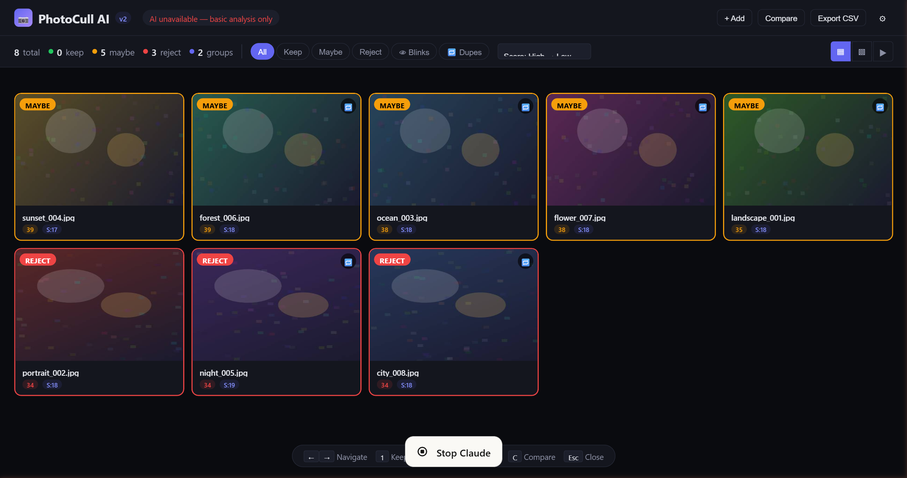

# PhotoCull AI

**Free, local-only AI photo culling for photographers.**

Drop your photos in, get them automatically sorted into Keep / Maybe / Reject — all running in your browser, nothing leaves your machine.

[](https://joneilcaoile.github.io/photocull-ai/photo-culler.html)


<!-- TODO: Add demo screenshot or GIF here -->
<!--  -->

**[Try it now](https://joneilcaoile.github.io/photocull-ai/photo-culler.html)** — no install, no account, no upload.

## Why This Exists

Photo culling tools like Aftershoot and FilterPixel cost $10-30/month and send your photos to the cloud. PhotoCull AI does it for free, locally, with zero accounts or uploads.

## Features

**Image Quality Analysis**
- Tenengrad sharpness (Sobel gradient with Gaussian pre-smoothing)
- Exposure scoring (histogram analysis, clipping detection, dynamic range)
- Noise estimation (local-mean residual isolation)
- Color & vibrance (saturation, vibrance, white balance/color cast detection)

**Portrait Intelligence**
- Face detection via TensorFlow.js BlazeFace
- Per-eye focus scoring relative to global sharpness
- Catchlight detection (specular highlights in eyes)
- Blink detection (eye region variance analysis)

**Smart Organization**
- Duplicate photo grouping via perceptual hash (dHash)
- Composition scoring (rule of thirds, face positioning, horizon detection)
- EXIF metadata analysis (ISO, aperture, shutter speed, focal length)

**Photographer Workflow**
- Three view modes: Grid, Large Grid, Filmstrip
- Keyboard rapid-culling (1/2/3 = Keep/Maybe/Reject, arrows to navigate)
- Side-by-side photo comparison (Shift+click two photos)
- Sort by score, name, sharpness, or ISO
- Filter by tier, blinks, or duplicates
- CSV export with all metrics and EXIF data
- Adjustable weights, thresholds, and feature toggles

## Quick Start

1. Open `photo-culler.html` in any modern browser (Chrome, Firefox, Edge, Safari)
2. Drop your photos in (or click to browse)
3. Wait for analysis to complete
4. Review results — use keyboard shortcuts for speed

That's it. No install, no build, no dependencies to manage.

## Architecture

```
photo-culler.html (single file)
│
├─ Image Loading ──→ FileReader + canvas downsampling
│
├─ Analysis Pipeline (per photo):
│   ├─ Sharpness ──────→ Tenengrad (Sobel gradient magnitude²)
│   ├─ Exposure ───────→ Histogram analysis + clipping detection
│   ├─ Noise ──────────→ Local-mean residual isolation
│   ├─ Color ──────────→ HSL saturation + vibrance + cast detection
│   ├─ Composition ────→ Rule of thirds + face positioning + horizon
│   ├─ EXIF ───────────→ Inline IFD0/ExifIFD parser (no library)
│   ├─ Face Detection ─→ TensorFlow.js BlazeFace (CDN)
│   │   ├─ Eye Focus ──→ Regional sharpness vs global
│   │   ├─ Catchlight ─→ Specular highlight detection
│   │   └─ Blink ──────→ Eye region luminance variance
│   └─ Duplicates ─────→ dHash (9×8 → 64-bit, Hamming ≤ 8)
│
├─ Scoring Model ──→ Weighted combination (DE-optimized coefficients)
│   └─ Portrait vs Non-Portrait weight redistribution
│
└─ UI Layer
    ├─ Grid / Large Grid / Filmstrip views
    ├─ Keyboard culling (1/2/3 + arrows)
    ├─ Side-by-side comparison
    └─ CSV export
```

## How It Works

PhotoCull AI combines two systems:

1. **Face Detection** — TensorFlow.js BlazeFace (pre-trained neural network by Google) locates faces and eye positions
2. **Quality Scoring** — Custom parametric scoring functions with ML-optimized coefficients evaluate sharpness, exposure, noise, composition, color, and EXIF metadata

The quality scorer uses coefficients optimized via differential evolution on a synthetic dataset with 5-fold stratified cross-validation to prevent overfitting. See [TRAINING_DOCUMENTATION.md](TRAINING_DOCUMENTATION.md) for the full technical breakdown.

## Keyboard Shortcuts

| Key | Action |
|-----|--------|
| `←` `→` | Navigate photos |
| `1` | Keep |
| `2` | Maybe |
| `3` | Reject |
| `Shift+Click` | Select for comparison |
| `Esc` | Close panel |

## Scoring Breakdown

Each photo gets scored 0-100 on multiple dimensions, combined into an overall score:

| Metric | Weight (Portrait) | What It Measures |
|--------|-------------------|-----------------|
| Sharpness | 28% | Edge definition via Tenengrad |
| Eye Focus | 35% | Sharpness specifically in eye regions |
| Exposure | 12% | Brightness, clipping, dynamic range |
| Catchlight | 10% | Specular highlights in eyes |
| Composition | 8% | Rule of thirds, face positioning |
| Color | 7% | Saturation, vibrance, white balance |

EXIF data (ISO, shutter speed, aperture) provides a subtle additional signal. Blink detection applies a flat penalty.

For non-portrait photos, eye/catchlight weights are redistributed to sharpness, exposure, composition, and color.

## Limitations

This is an honest project, so here's what it can't do:

- **Not as accurate as paid tools** for subjective "which looks better" judgments — they use deep CNNs trained on millions of real photos
- **No expression analysis** — detects blinks but not smiles or emotions
- **No personalization** — doesn't learn your preferences over time (weights are manually adjustable though)
- **Single-threaded** — large batches (500+) will be slow in the browser
- **JPEG EXIF only** — RAW files aren't supported yet

## Roadmap

- [ ] NIMA (Neural Image Assessment) integration via TensorFlow.js for deep-learned quality scoring
- [ ] MediaPipe FaceMesh for precise blink detection and expression analysis
- [ ] Web Worker background processing for non-blocking batch analysis
- [ ] RAW file support
- [ ] XMP sidecar export for Lightroom/Capture One integration
- [ ] IndexedDB caching for instant re-analysis

## Tech Stack

- Single HTML file (2,754 lines)
- Vanilla JavaScript (no framework)
- TensorFlow.js + BlazeFace (loaded from CDN)
- Built-in EXIF parser (no external library)
- CSS custom properties for theming

## Security

PhotoCull AI is security-hardened for public deployment:

- HTML entity escaping (`esc()`) on all user-controlled strings (filenames, EXIF data)
- Content Security Policy meta tag restricting script/image/connect sources
- 80MB file size limit to prevent resource exhaustion
- No `eval()`, no dynamic code execution, no cookies, no storage

See [SECURITY.md](SECURITY.md) for the full security policy and how to report vulnerabilities.

## Acknowledgments

- [TensorFlow.js](https://www.tensorflow.org/js) and [BlazeFace](https://github.com/niconielsen32/ComputerVision/tree/master/BlazeFace) — face detection model by Google
- Tenengrad sharpness metric — based on Krotkov (1988), "Focusing" in *International Journal of Computer Vision*
- dHash perceptual hashing — based on the approach described by [Dr. Neal Krawetz](https://www.hackerfactor.com/blog/index.php?/archives/529-Kind-of-Like-That.html)
- Differential evolution — Storn & Price (1997), "Differential Evolution — A Simple and Efficient Heuristic for Global Optimization"

## License

MIT — see [LICENSE](LICENSE).

## Contributing

PRs welcome! See [CONTRIBUTING.md](CONTRIBUTING.md) for guidelines.

The codebase is a single file by design (easy to fork, share, modify). The highest-impact contributions right now:

1. **NIMA integration** for deep-learned quality scoring
2. **Web Worker processing** for better performance on large batches
3. **More EXIF tags** (white balance, metering mode, flash)
4. **Better blink detection** via face landmarks model
